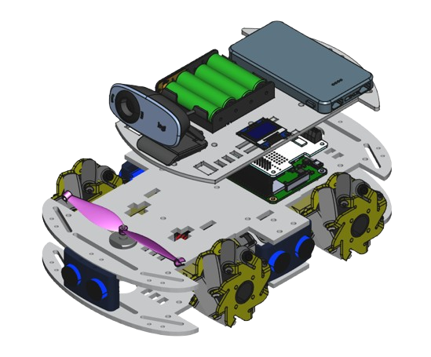
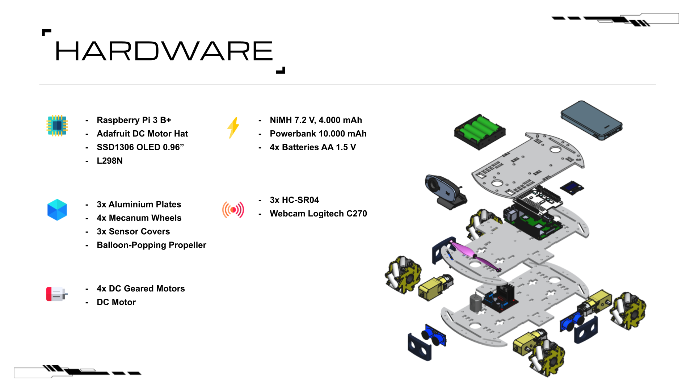

<!-- Banner -->

  

### Project Overview

RaspyBot is a robotics project developed using Python and powered by a Raspberry Pi. The robot utilizes **PID control** and **computer vision** to engage in combat against other robots. The goal is to pop balloons on opposing robots, with the losing robot being the one that runs out of balloons.

---

### Objectives

- Design and assemble the robot hardware, including the selection of components and 3D-printed weapon.  
 

- Implement a system for detecting and tracking balloons.
 

- Develop a telemetry panel and remote control interface for robot management.
 

- Enable balloon identification and tracking while avoiding obstacles.
 

- Improve the system’s performance and precision over time.

---

### Directory Structure

The directory structure of this project is organized as follows:

// ToDo //

---

### Components Overview

  

---

### Demo

  

---

### Special Thanks

<!-- Footer -->

  

